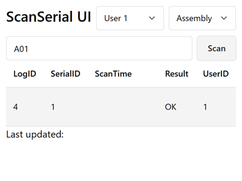
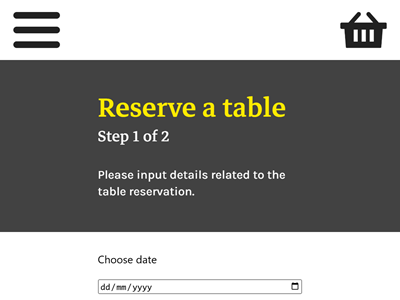
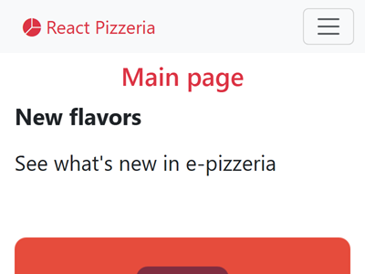

# react-webpages

My ReactJS webpage projects.

You can view the project using the link in this repository's About section.

> [!TIP]
> Try inputting serial numbers `A01`, `A02`, `B01`, `B02`, `B03` on "mes-sandbox" ("Scan Serial UI") web app to see different results. The source code can be found in my repository `mes-sandbox/node-red-uibuilder/scanserial-ui-react`.

## More pages coming soon

Currently, the project is in a beta version, combining pages built separately from my repositories. In the stable version, the project will unify React to use a single core build (rather than a mix of Vite with static sites, Create React App, etc.).

Additionally, the web app shown below is currently in development and will be added into this project soon.

